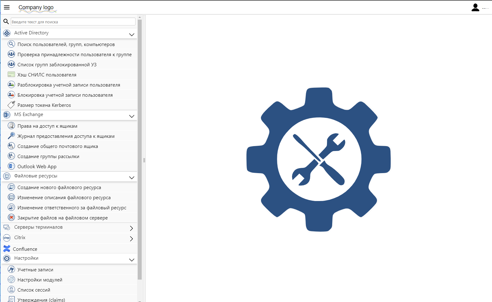
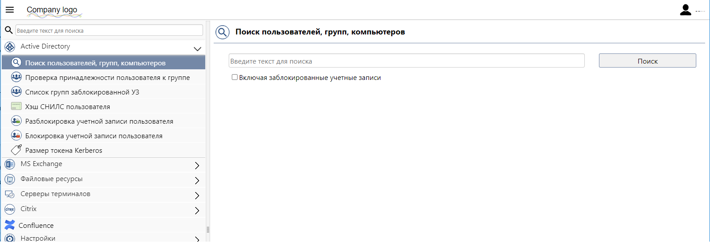
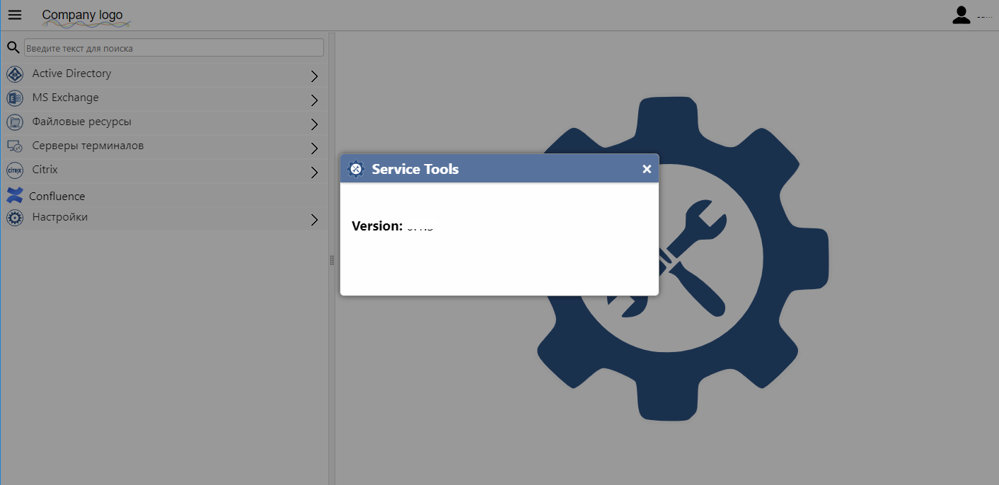

<table>
  <tr>
    <td vertical-align="middle">  </td>
    <td vertical-align="middle"> <h1 align="left">Service Tools</h1> </td>
  </tr>
</table>

<h2> ПО для автоматизации и делегирования рутинных административных задач</h2> 

В процессе работы системных администраторов существует широкий спектр рутинных операций, которые не требуют высокой квалификации исполнителя, однако могут отнимать большой объем времени, приводя к непроизводительным потерям рабочего времени квалифицированных специалистов. Такие операции, как правило, могут оперативно выполняться исполнителями на местах (специалистами, отвечающими за непосредственную поддержку рабочих мест, либо специалистами центров поддержки пользователей, контакт-центров и т.п.), без необходимости обращения к администраторам.  

Service Tools разработан чтобы разгрузить администраторов, и позволяет посредством простого и понятного веб-интерфейса делегировать полномочия на выполнение рутинных административных операций специалистам предыдущих линий тех. поддержки (либо сотрудникам смежных подразделений).  

Веб-приложение разработано с использованием языка C# и платформы ASP.NET (4.8), а также модулей на языке Powershell, позволяет предоставить пользователю каскадное меню со списком доступных ему модулей, а также ссылок на другие веб-ресурсы. При выборе в меню какого-либо модуля, пользователь может в интерфейсе этого модуля ввести/выбрать необходимые данные, и выполнить требуемые операции (в зависимости от функционала модуля). При этом права доступа пользователей к тем или иным модулям, и отдельному функционалу внутри модулей можно строго разграничить, а выполняемые пользователями действия логируются.  
Внедрение ПО позволит значительно сократить нагрузку на системных администраторов и делегировать большое количество рутинных операций сотрудникам тех.поддержки, например:
&nbsp;&nbsp;&nbsp;<li>предоставление специалистам тех.поддержки необходимого им для работы широкого спектра информации об учетных записях пользователей AD</li>
&nbsp;&nbsp;&nbsp;<li>создание, блокировка и разблокировка различных учетных записей</li>
&nbsp;&nbsp;&nbsp;<li>создание групп безопасности в AD, изменение их состава</li>
&nbsp;&nbsp;&nbsp;<li>изменение и сброс паролей учетных записей</li>
&nbsp;&nbsp;&nbsp;<li>создание персональных либо сервисных почтовых ящиков, предоставление доступа к ним (доступ к ящику целиком, к отдельным элементам, либо права на отправку сообщений от имени выбранного адресата)</li>
&nbsp;&nbsp;&nbsp;<li>создание файловых ресурсов, предоставление/отзыв прав доступа к ним и другие, связанные с ними сервисные операции (изменение ответственного, описания, завершение сессий для освобождения заблокированных файлов и т.п.)</li>
&nbsp;&nbsp;&nbsp;<li>поиск и принудительное завершение всех терминальных сессий указанного пользователя (на всех серверах предприятия)</li>

  

