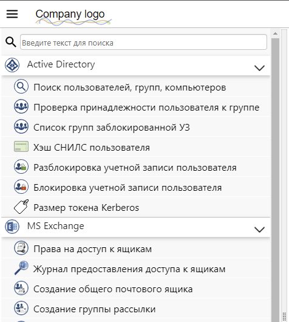

<h1 align="left" vertical-align="center">&nbsp;Service Tools</h1>
<h3>Инструмент для автоматизации рутинных задач и делегирования административных полномочий</h3>

&nbsp;&nbsp;&nbsp;В процессе работы системных администраторов существует широкий спектр рутинных операций, которые не требуют высокой квалификации исполнителя, однако могут отнимать большой объем времени, приводя к непроизводительным потерям рабочего времени квалифицированных специалистов. Такие операции, как правило, могут оперативно выполняться исполнителями на местах (специалистами, отвечающими за непосредственную поддержку рабочих мест, либо специалистами центров поддержки пользователей, контакт-центров и т.п.), без необходимости обращения к администраторам.

_____________________________

&nbsp;&nbsp;&nbsp;Service Tools создан чтобы разгрузить системных администраторов, и позволяет посредством простого и интуитивно понятного веб-интерфейса делегировать полномочия для выполнения административных действий специалистам предыдущих линий тех. поддержки (либо сотрудникам смежных подразделений),
а также создавать инструменты с удобным интерфейсом для выполнения рутинных операций самими администраторами. 
&nbsp;&nbsp;&nbsp;Данный инструмент позволяет значительно сократить нагрузку на системных администраторов и повысить эффективность их работы. 

_____________________________

&nbsp;&nbsp;&nbsp;Веб-интерфейс приложения представляет собой каскадное меню со списком модулей, а также ссылок на другие веб-ресурсы.

При выборе в меню какого-либо модуля, пользователь может в интерфейсе ввести/выбрать необходимые данные, выполнить требуемые операции либо сформировать нужный отчет (в зависимости от функционала модуля).  
&nbsp;&nbsp;&nbsp;Гибкий механизм разграничения доступа позволяет динамически формировать для каждой категории пользователей индивидуальное меню и разграничить доступ как к модулям, так и к отдельному функционалу внутри модулей.
При этом ведется лог выполняемых пользователями действий.

&nbsp;&nbsp;&nbsp;Благодаря модульности функционал приложения можно расширять/адаптировать под конкретные нужды.
В приложении используются модули на языке Powershell, благодаря чему системные администраторы могут их создавать/модифицировать без привлечения разработчиков.  
&nbsp;&nbsp;&nbsp;ПО разработано с использованием языка C# и платформы ASP.NET (4.8), разработка модулей ведется на языке Powershell.

 <h3>Примеры задач, которые можно решить, делегировав административные полномочия:</h3>
<ul>
&nbsp;&nbsp;&nbsp;<li>предоставление специалистам тех.поддержки необходимого им для работы широкого спектра информации об учетных записях пользователей AD</li>
&nbsp;&nbsp;&nbsp;<li>создание, блокировка и разблокировка различных учетных записей</li>
&nbsp;&nbsp;&nbsp;<li>создание групп безопасности в AD, изменение их состава</li>
&nbsp;&nbsp;&nbsp;<li>изменение и сброс паролей учетных записей</li>
&nbsp;&nbsp;&nbsp;<li>создание персональных либо сервисных почтовых ящиков, предоставление доступа к ним (доступ к ящику целиком, к отдельным элементам, либо права на отправку сообщений от имени выбранного адресата)</li>
&nbsp;&nbsp;&nbsp;<li>создание файловых ресурсов, предоставление/отзыв прав доступа к ним и другие, связанные с ними сервисные операции (изменение ответственного, описания, завершение сессий для освобождения заблокированных файлов и т.п.)</li>
&nbsp;&nbsp;&nbsp;<li>поиск и принудительное завершение всех терминальных сессий указанного пользователя (на всех серверах предприятия)</li>
&nbsp;&nbsp;&nbsp;<li>и многе другое...</li>
</ul>

<h3>Интерфейс приложения:</h3> 

  

  

